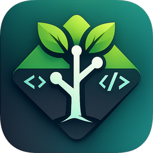
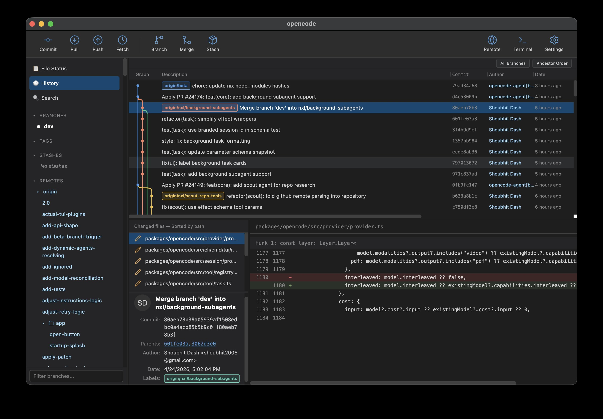

<div align="center">



# GitArbor

A modern graphical Git client for Linux, macOS, and Windows.

[](./LICENSE)
[](https://www.electronjs.org/)
[](https://svelte.dev/)
[](https://www.typescriptlang.org/)
[](https://bun.sh/)

</div>

---

## Features

- **Commit history** with a live-computed commit graph
- **Branch sidebar** with checkout, create, and HEAD highlighting
- **Working changes** view with staging, unstaging, and rich diff
- **Commit panel** for crafting commits without leaving the app
- **Stash**: create, apply, and drop — with a dedicated dialog
- **Create branch** from any commit, with live slug preview
- **Multi-repo switching** through the native system menu
- **Cross-platform installers**: `.deb`, `.rpm`, Windows `.exe` _(not tested)_, macOS `.zip`

See [FEATURES.md](./FEATURES.md) for the full feature matrix and roadmap.

## Screenshots



## Installation

Pre-built installers will be attached to each
[GitHub Release](https://github.com/johniak/gitarbor/releases):

- **Linux**: `.deb` or `.rpm`
- **Windows**: Squirrel `.exe` installer — _builds in CI but is not actively tested yet_
- **macOS**: `.zip` — unpack and move `GitArbor.app` to `/Applications`

## Development Setup

**Prerequisites:** [Bun](https://bun.sh/), [Node.js](https://nodejs.org/), Git.

```bash
git clone https://github.com/johniak/gitarbor.git
cd gitarbor
bun install
bun run start
```

## Tech Stack

| Layer       | Tech                                                                                                                                                    |
| ----------- | ------------------------------------------------------------------------------------------------------------------------------------------------------- |
| Runtime     | [Electron](https://www.electronjs.org/) + [Electron Forge](https://www.electronforge.io/) + [Vite](https://vitejs.dev/)                                 |
| UI          | [Svelte 5](https://svelte.dev/) (runes), [Skeleton](https://www.skeleton.dev/), [Tailwind CSS](https://tailwindcss.com/), [Lucide](https://lucide.dev/) |
| Git backend | [`simple-git`](https://github.com/steveukx/git-js) in the Electron main process                                                                         |
| Storage     | [`sql.js`](https://sql.js.org/) (WASM SQLite) + [Drizzle ORM](https://orm.drizzle.team/)                                                                |
| Tooling     | [Bun](https://bun.sh/), [TypeScript](https://www.typescriptlang.org/), [ESLint](https://eslint.org/), [Prettier](https://prettier.io/)                  |
| Testing     | [Vitest](https://vitest.dev/), [Playwright](https://playwright.dev/)                                                                                    |

## Scripts

| Script              | What it does                                 |
| ------------------- | -------------------------------------------- |
| `bun run start`     | Launch the app in dev mode (hot reload)      |
| `bun run test`      | Run Vitest unit tests                        |
| `bun run test:e2e`  | Package the app and run Playwright e2e tests |
| `bun run lint`      | Run ESLint                                   |
| `bun run format`    | Format with Prettier                         |
| `bun run typecheck` | Run `tsc --noEmit`                           |
| `bun run package`   | Package the app for the current platform     |
| `bun run make`      | Build distributable installers               |

## Project Structure

```
src/
  main/      # Electron main process (IPC handlers, git service, DB)
  preload/   # contextBridge (typed API exposure)
  renderer/  # Svelte 5 UI
  shared/    # IPC channel names + shared types
e2e/         # Playwright + Electron tests
build/icons/ # App icons for every platform
```

## Contributing

Contributions are welcome. Please read [CONTRIBUTING.md](./CONTRIBUTING.md) and
abide by the [Code of Conduct](./CODE_OF_CONDUCT.md).

## Disclaimer

GitArbor is an independent project and is not affiliated with the Git project
or Atlassian. "Git" is a trademark of Software Freedom Conservancy; all other
trademarks belong to their respective owners.

## License

Released under the [MIT License](./LICENSE).
